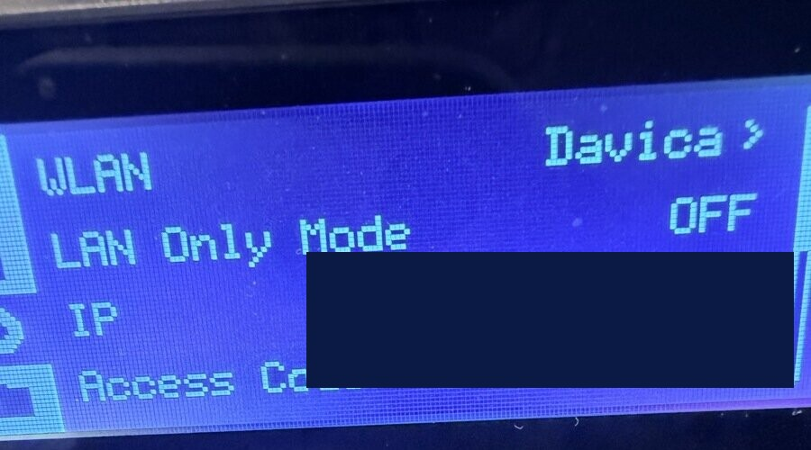
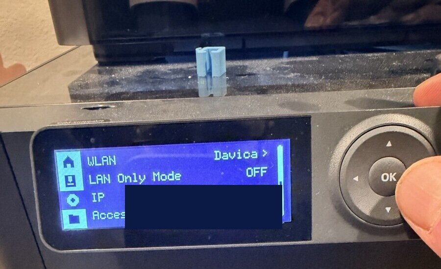
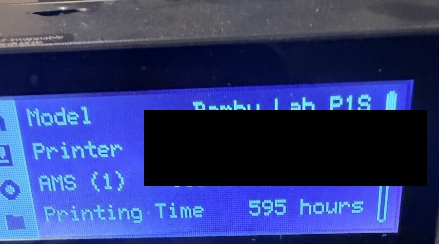

# Setup reference for agents and manual configuration

[Back to README](../README.md#set-up-with-your-agent) · [Slicing guide](./SLICING.md) · [FULU guide](./FULU.md)

The README provides the copy-and-paste setup request. Use this reference for exact environment variables, per-printer credentials, manual MCP client configuration, Docker, and troubleshooting. Preserve the user's existing MCP configuration and use the current harness's supported configuration format.

## Installation

### Prerequisites

- Node.js 24, recommended (the package supports Node.js 18 or later, CI tests 18 through 24, and the Docker image uses 24)
- npm
- **A slicer** *(only needed to slice)*: PrusaSlicer, OrcaSlicer, [FULU OrcaSlicer-bambulab](https://github.com/FULU-Foundation/OrcaSlicer-bambulab), Bambu Studio, Slic3r, or CuraEngine. A file that is already sliced can be uploaded and printed without a slicer on the MCP host. See the [slicing guide](./SLICING.md).
- **Blender with a Blender MCP server** *(optional)*: only for the `blender_mcp_*` tools. See [Blender MCP](#blender-mcp-optional).

### Run without installing (npx)

The fastest way to get started. No global install is required:

```bash
npx -y mcp-3d-printer-server
```

MCP clients normally launch this command for you over stdio. Set environment variables in the client's MCP configuration or in a `.env` file in the server's working directory (see [Configuration](#configuration)).

### Install globally from npm

```bash
npm install -g mcp-3d-printer-server
```

The package installs three commands: `mcp-3d-printer-server` (stdio by default), `mcp-3d-printer-server-http` (streamable HTTP), and `mcp-3d-printer-server-sse` (a legacy name that also starts the streamable HTTP runtime).

### Install from source

```bash
git clone https://github.com/DMontgomery40/mcp-3D-printer-server.git
cd mcp-3D-printer-server
npm ci
npm run build
npm link
```

`npm link` makes the `mcp-3d-printer-server` command available globally without publishing to npm. Build from a clean checkout before linking; `dist/` is generated and not tracked in Git.

---

## Choose your printer backend

`PRINTER_TYPE` selects the printer adapter. Every printer tool also accepts `type`, `host`, `port`, and `api_key` arguments, so one server can reach more than one printer; values you omit fall back to the environment.

`PRINTER_PORT` defaults to `80` for every backend. Set it explicitly when your system listens elsewhere, such as Moonraker on `7125` or Repetier-Server on `3344`.

| `PRINTER_TYPE` | System | Connection | Credentials | Testing evidence |
|---|---|---|---|---|
| `bambu` | Bambu Lab | MQTT over TLS on port 8883, FTPS on port 990 | `BAMBU_SERIAL`, `BAMBU_TOKEN` (LAN access code), `BAMBU_MODEL` | **Most tested.** Maintainer hardware testing, shared with the Bambu-only fork. The FTPS fix for [#22](https://github.com/DMontgomery40/mcp-3D-printer-server/issues/22) is tested against a local FTPS server; confirmation on the reporter's X1C is outstanding. |
| `octoprint` | OctoPrint | HTTP REST API, port 80 on OctoPi | `API_KEY`, sent as `X-Api-Key` | **Community-reported.** Used against a real OctoPrint instance in [#4](https://github.com/DMontgomery40/mcp-3D-printer-server/issues/4). |
| `klipper` | Klipper (Moonraker) | HTTP API, usually port 7125 | None sent; Moonraker must trust the MCP host | **Community-reported.** Used with a Creality K1 Max through Moonraker in [#16](https://github.com/DMontgomery40/mcp-3D-printer-server/issues/16). |
| `prusa` | PrusaLink / Prusa Connect | HTTP for local PrusaLink, HTTPS for `connect.prusa3d.com` or port 443 | `API_KEY`, sent as `X-Api-Key` and as a bearer token | **Community-reported.** PrusaLink 0.8.1 status fixed after [#11](https://github.com/DMontgomery40/mcp-3D-printer-server/issues/11); Prusa Connect setup discussed in [#9](https://github.com/DMontgomery40/mcp-3D-printer-server/issues/9). |
| `duet` | Duet | HTTP, port 80 | None sent | **Unverified.** No hardware reports yet. |
| `repetier` | Repetier-Server | HTTP, usually port 3344 | `API_KEY`, sent as the `apikey` query parameter | **Unverified.** No hardware reports yet. |
| `creality` | Creality | HTTP, port 80 | `API_KEY`, sent as a bearer token | **Unverified.** No hardware reports yet. |

Bambu Lab has the most hardware testing. The other adapters call each system's HTTP API as described in [Printer backend setup](#printer-backend-setup), and hardware evidence comes from community reports. If a backend misbehaves, please [open an issue](https://github.com/DMontgomery40/mcp-3D-printer-server/issues) with the printer, firmware or host software version, and the tool error.

---

## Configuration

Create a `.env` file in the directory where you run the server, or pass environment variables in your MCP client configuration. Configure only the block for your backend.

```env
# --- Printer backend (pick one PRINTER_TYPE) ---
PRINTER_TYPE=octoprint            # octoprint, klipper, duet, repetier, bambu, prusa, creality
PRINTER_HOST=192.168.1.100        # Printer or host-software address
PRINTER_PORT=80                   # 7125 for Moonraker, 3344 for Repetier-Server
API_KEY=your_api_key              # OctoPrint, Repetier, Prusa, Creality

# --- Bambu Lab only ---
# BAMBU_SERIAL=01P00A123456789    # Printer serial number
# BAMBU_TOKEN=your_access_code    # LAN access code from the printer screen
# BAMBU_MODEL=p1s                 # Required for Bambu print operations
# BED_TYPE=textured_plate         # textured_plate, cool_plate, engineering_plate, hot_plate
# BAMBU_NOZZLE_TYPE=hardened_steel # Only if you replaced the stock nozzle (P1S/P1P/A1 ship stainless_steel)
# NOZZLE_DIAMETER=0.4             # 0.2, 0.4, 0.6, or 0.8 for printing and heating

# --- Print and heating safety (see "Print and heating safety" below) ---
# PRINT_REQUIRE_CONFIRMATION=0    # Headless only: skip ordinary confirmations (all printers)
# BAMBU_REQUIRE_CONFIRMATION=0    # Headless only: the same, for Bambu printers only
# PRINTER_MAX_NOZZLE_TEMP=300     # Non-Bambu heater ceilings in °C (Bambu uses per-model limits)
# PRINTER_MAX_BED_TEMP=120
# PRINTER_MAX_CHAMBER_TEMP=60

# --- Slicer (only for slice_stl, process_and_print_stl, and Bambu auto-slicing) ---
# SLICER_TYPE=prusaslicer         # prusaslicer, slic3r, orcaslicer, orcaslicer-bambulab, bambustudio, cura
# SLICER_PATH=/path/to/slicer/executable
# SLICER_PROFILE=/path/to/profile # Bambu-compatible slicers: a process profile only
# FILAMENT_PROFILE=/path/to/filament.json
# BAMBU_PROFILES_ROOT=            # Profile tree containing BBL/, if not found from SLICER_PATH
# BAMBU_TEMPLATE_DIR=~/Sync/bambu/templates

# --- MCP transport ---
# MCP_TRANSPORT=stdio             # stdio (default) or streamable-http
# MCP_HTTP_HOST=127.0.0.1
# MCP_HTTP_PORT=3000
# MCP_HTTP_PATH=/mcp

# --- Optional standard Blender MCP server ---
# BLENDER_MCP_COMMAND=/full/path/to/uvx
# BLENDER_MCP_ARGS=["mcp-for-blender"]
# BLENDER_MCP_TIMEOUT_MS=120000
```

### Environment variables reference

| Variable | Default | Required | Description |
|---|---|---|---|
| `PRINTER_TYPE` | `octoprint` | Yes | Printer adapter: `octoprint`, `klipper`, `duet`, `repetier`, `bambu`, `prusa`, or `creality` |
| `PRINTER_HOST` | `localhost` | Yes | Printer or host-software address. Prusa also accepts `connect.prusa3d.com` or a full `https://` URL |
| `PRINTER_PORT` | `80` | Depends on backend | HTTP port for non-Bambu backends. Set `7125` for Moonraker and `3344` for Repetier-Server |
| `API_KEY` | | OctoPrint, Repetier, Prusa, Creality | Backend API key or token. Klipper and Duet adapters do not send one |
| `BAMBU_SERIAL` | | Bambu | Printer serial number |
| `BAMBU_TOKEN` | | Bambu | LAN access code shown on the printer |
| `BAMBU_MODEL` | | **Bambu printing and Bambu slicing** | Printer model: `p1s`, `p1p`, `x1c`, `x1e`, `a1`, `a1mini`, `h2d`. **Required** for `print_3mf`, `start_print`, upload with `print: true`, positive Bambu heating, and Bambu-compatible slicing. Slicing also accepts `p2s`, `h2s`, and `h2c` when the installed slicer has that preset. If omitted and the MCP client supports elicitation, the server asks. It selects the slicer machine preset and is checked against the live printer before printing. |
| `BED_TYPE` | `textured_plate` | No | Bambu bed plate: `textured_plate`, `cool_plate`, `engineering_plate`, `hot_plate`. `print_3mf` requires it to match the sliced plate's bed metadata |
| `NOZZLE_DIAMETER` | `0.4` | No | Nozzle diameter in mm. Selects the Bambu machine preset; printing and heating accept 0.2, 0.4, 0.6, or 0.8 and check it against the live printer |
| `PRINT_REQUIRE_CONFIRMATION` | confirmation on | No | Only an explicit `0` skips the ordinary human confirmation before print starts and positive heating, on every printer type. The first print after a finished job still asks. See [print and heating safety](#print-and-heating-safety) |
| `BAMBU_REQUIRE_CONFIRMATION` | confirmation on | No | Bambu-only form of `PRINT_REQUIRE_CONFIRMATION=0` |
| `BAMBU_NOZZLE_TYPE` | model preset's stock nozzle | No | Installed nozzle for slicing: `stainless_steel`, `hardened_steel`, `tungsten_carbide`, or `brass`. Set it if you upgraded the nozzle; printing requires the job's nozzle type to match the printer's report |
| `BAMBU_DISPATCH_CHECK_MS` | `15000` | No | How long to watch the printer's reports after a print command to confirm it started or was refused (0 to 60000; 0 skips the check) |
| `PRINT_CONFIRMATION_TIMEOUT_MS` | `600000` (10 minutes) | No | How long a person has to answer a confirmation prompt, from 1000 to 3600000. When it runs out, nothing is sent and the error says so |
| `PRINTER_MAX_NOZZLE_TEMP` | `300` | No | Nozzle ceiling in °C for non-Bambu printers. Only the server environment can change it; an invalid value refuses printing and positive heating |
| `PRINTER_MAX_BED_TEMP` | `120` | No | Bed ceiling in °C for non-Bambu printers |
| `PRINTER_MAX_CHAMBER_TEMP` | `60` | No | Chamber ceiling in °C for non-Bambu printers |
| `SLICER_TYPE` | `orcaslicer-bambulab` when `PRINTER_TYPE=bambu`, otherwise `prusaslicer` | No | `prusaslicer`, `slic3r`, `orcaslicer`, `orcaslicer-bambulab` (FULU), `bambustudio`, or `cura`. See [slicer aliases](./SLICING.md#slicer-types-and-aliases) |
| `SLICER_PATH` | Common install paths for FULU/Orca and Bambu Studio; none for other slicers | To slice | Slicer executable. Per-call `slicer_path` requires `MCP_ALLOW_EXECUTABLE_ARG=1` |
| `SLICER_PROFILE` | | No | Bambu-compatible slicers: one process profile JSON; the machine preset always comes from the model and nozzle. Generic OrcaSlicer: `machine.json;process.json`, optionally `\|filament.json`. See the [slicing guide](./SLICING.md#profiles) |
| `FILAMENT_PROFILE` | | No | Filament profile path(s) loaded with `--load-filaments`, `;`-separated in slot order. Alias: `SLICER_FILAMENT_PROFILE` |
| `SLICER_TIMEOUT_MS` | `600000` | No | Slicer process deadline in milliseconds |
| `BAMBU_PROFILES_ROOT` | found from `SLICER_PATH` | No | Profile tree containing `BBL/` for the active Bambu-compatible slicer. Set it for AppImages or non-standard installs. It is never replaced by another installation's tree |
| `BAMBU_SLICER_PROFILE_DIRS` | the slicers' user `system/BBL` directories | No | Directories (separated with your OS path delimiter) searched for custom process and filament parents, never for machine presets. Set it empty to disable the search |
| `BAMBU_TEMPLATE_DIR` | `~/Sync/bambu/templates` | No | Local template registry for `slice_with_template`, `list_templates`, `save_template`, and `get_slice_settings` |
| `BAMBU_TEMPLATE_3MF_PATH` | | No | Default template 3MF whose slicer settings are reused as the process profile |
| `FULU_ORCA_PATH` | | No | FULU OrcaSlicer-bambulab executable when `SLICER_PATH` is unset. Aliases: `ORCASLICER_BAMBULAB_PATH`, `ORCA_SLICER_BAMBULAB_PATH` |
| `FULU_ORCA_PLUGIN_DIR` | | No | Directory with FULU's runtime payload, such as `OrcaSlicer.app/Contents/MacOS`. Alias: `ORCASLICER_BAMBULAB_PLUGIN_DIR` |
| `PJARCZAK_MAC_RUNTIME_DIR` | `~/Library/Application Support/OrcaSlicer/macos-bridge/runtime` | No | Installed FULU macOS runtime directory |
| `FULU_BAMBU_BRIDGE_COMMAND` | | FULU bridge tools | Trusted command that starts the FULU BambuNetwork bridge host. See the [FULU guide](./FULU.md) |
| `MCP_ALLOW_EXECUTABLE_ARG` | disabled | No | Accept per-call executable selectors (`slicer_path`, `bridge_command`, and bridge probe paths). Leave off for normal use; see [executable settings](#executable-settings-stay-in-server-configuration) |
| `MCP_ALLOW_BRIDGE_COMMAND_ARG` | disabled | No | Legacy opt-in for bridge commands and bridge-derived probe paths only |
| `TEMP_DIR` | private folder under the system temporary directory | No | Intermediate files. Each server instance gets its own folder unless you set this |
| `MCP_TRANSPORT` | `stdio` | No | `stdio` or `streamable-http` |
| `MCP_HTTP_HOST` | `127.0.0.1` | No | HTTP bind address (HTTP transport only) |
| `MCP_HTTP_PORT` | `3000` | No | HTTP port. The legacy `-http` and `-sse` commands also read `HTTP_PORT` and `SSE_PORT` |
| `MCP_HTTP_PATH` | `/mcp` | No | HTTP endpoint path |
| `MCP_HTTP_STATEFUL` | `true` | No | Stateful HTTP sessions |
| `MCP_HTTP_JSON_RESPONSE` | `true` | No | Return JSON responses instead of event streams where possible |
| `MCP_HTTP_ALLOWED_ORIGINS` | | No | Comma-separated allowed browser origins. Requests with any other `Origin` header are rejected; requests without one are accepted |
| `BLENDER_MCP_COMMAND` | | No | Trusted executable for a standard stdio Blender MCP server, such as the full path to `uvx` |
| `BLENDER_MCP_ARGS` | `[]` | No | JSON array of arguments, such as `["mcp-for-blender"]`; no shell parsing |
| `BLENDER_MCP_TIMEOUT_MS` | `120000` | No | Connection, discovery, and call deadline, 100 to 300000 ms |
| `BLENDER_MCP_BRIDGE_COMMAND` | | No | Legacy trusted shell command for `blender_mcp_edit_model`; separate from the standard MCP integration |

The Blender MCP server also reads its own `BLENDER_HOST` and `BLENDER_PORT` (default `localhost:9876`) if the addon listens elsewhere. This server passes only `BLENDER_*` settings to it, never printer credentials. See the [Blender guide](./BLENDER.md).

---

## Print and heating safety

Every print start and positive heating command goes through the same gate on every backend. Heater-off (a target of 0) and `cancel_print` are never gated, and cancelling also cancels checked prints that are still waiting to start.

- **Human confirmation.** The server asks a person through MCP elicitation before each print start and positive heating command. Clients without elicitation support are refused with instructions. `PRINT_REQUIRE_CONFIRMATION=0` (all printers) or `BAMBU_REQUIRE_CONFIRMATION=0` (Bambu only) opts out for deliberately headless setups. A printer that reports a finished job (Moonraker complete or cancelled, PrusaLink FINISHED or STOPPED, Bambu FINISH) always asks, even with the opt-out, because the last part may still be on the bed.
- **File inspection.** The server inspects a private copy of the exact G-code or 3MF plate it will start: every `S` and `R` heater target, tool changes, and RepRapFirmware and Klipper heater commands. Klipper macro parameters that name a heater are checked; macro bodies stored on the printer cannot be.
- **Ceilings.** Nozzle, bed, and chamber targets have independent ceilings: 300, 120, and 60 °C by default on non-Bambu printers (`PRINTER_MAX_NOZZLE_TEMP`, `PRINTER_MAX_BED_TEMP`, `PRINTER_MAX_CHAMBER_TEMP`), and per-model hardware limits on Bambu printers. Material ceilings also apply, such as 260 °C for PLA. Only the server environment can change a ceiling; tool arguments and G-code never raise one.
- **Declared material.** Printing and positive nozzle heating need a material: slicer metadata in the G-code (`; filament_type = PETG`) or the `material` argument, which must not contradict the file. A declaration cannot prove which spool is physically loaded.
- **Printer state.** Printing, paused, errored, offline, or unreadable printers are refused. On Bambu printers, a fresh MQTT report must match the model, serial, nozzle, and loaded filament, before and after the confirmation and again before dispatch.
- **Files already on the printer.** `start_print` downloads the file, inspects it, and starts a uniquely named checked copy on Bambu Lab, OctoPrint, Klipper (Moonraker), and Duet. Repetier, Prusa, and Creality refuse remote starts because no verified download route exists; upload the local G-code with `print: true`.
- **Expected temperatures.** `process_and_print_stl` refuses before uploading when `extruder_temp` or `bed_temp` differs from the sliced job's highest target.

Known gaps: Klipper macro bodies and RepRapFirmware stored tool temperatures (used when a job selects a tool with `T0` without setting a target first) live on the printer and cannot be inspected. Activation-only `M568` and `M144` commands are refused for that reason.

Evidence: the gate is covered by unit tests and MCP-level tests with mocked MQTT and FTPS boundaries and loopback HTTP printer APIs. On one real P1S, the Bambu path read fresh status, refused a job sliced for the wrong nozzle type, asked for confirmation, and uploaded the checked file. The firmware then refused the unsigned start command because Developer Mode was off. Acceptance at a mocked boundary does not prove firmware behavior, and the other printer systems have not been exercised on real hardware in this release.

---

## MCP client configuration

Add the server to your MCP client (Claude Desktop, Claude Code, Cursor, Codex, or any MCP-compatible client). JSON-based clients use an `mcpServers` entry with the command, arguments, and environment. This OctoPrint example shows the shape:

```json
{
  "mcpServers": {
    "3dprint": {
      "command": "npx",
      "args": ["-y", "mcp-3d-printer-server"],
      "env": {
        "PRINTER_TYPE": "octoprint",
        "PRINTER_HOST": "192.168.1.100",
        "PRINTER_PORT": "80",
        "API_KEY": "your_octoprint_api_key"
      }
    }
  }
}
```

Replace the `env` block with the values for your backend:

| Backend | `env` values |
|---|---|
| OctoPrint | `PRINTER_TYPE=octoprint`, `PRINTER_HOST`, `PRINTER_PORT` (80 on OctoPi, 5000 for `octoprint serve`), `API_KEY` |
| Klipper (Moonraker) | `PRINTER_TYPE=klipper`, `PRINTER_HOST`, `PRINTER_PORT=7125` |
| Duet | `PRINTER_TYPE=duet`, `PRINTER_HOST`, `PRINTER_PORT` if not 80 |
| Repetier-Server | `PRINTER_TYPE=repetier`, `PRINTER_HOST`, `PRINTER_PORT=3344`, `API_KEY` |
| Bambu Lab | `PRINTER_TYPE=bambu`, `PRINTER_HOST`, `BAMBU_SERIAL`, `BAMBU_TOKEN`, `BAMBU_MODEL` |
| PrusaLink | `PRINTER_TYPE=prusa`, `PRINTER_HOST` (printer IP), `API_KEY` |
| Prusa Connect | `PRINTER_TYPE=prusa`, `PRINTER_HOST=connect.prusa3d.com`, `PRINTER_PORT=443`, `API_KEY` |
| Creality | `PRINTER_TYPE=creality`, `PRINTER_HOST`, `PRINTER_PORT` if not 80, `API_KEY` |

A Bambu Lab example with FULU OrcaSlicer-bambulab slicing:

```json
{
  "mcpServers": {
    "3dprint": {
      "command": "npx",
      "args": ["-y", "mcp-3d-printer-server"],
      "env": {
        "PRINTER_TYPE": "bambu",
        "PRINTER_HOST": "192.168.1.100",
        "BAMBU_SERIAL": "01P00A123456789",
        "BAMBU_TOKEN": "your_lan_access_code",
        "BAMBU_MODEL": "p1s",
        "SLICER_TYPE": "orcaslicer-bambulab",
        "SLICER_PATH": "/Applications/OrcaSlicer.app/Contents/MacOS/OrcaSlicer"
      }
    }
  }
}
```

Codex uses TOML instead of JSON. Add a `[mcp_servers.<name>]` table to `config.toml`, or manage servers with `codex mcp`:

```toml
[mcp_servers.3dprint]
command = "npx"
args = ["-y", "mcp-3d-printer-server"]
env = { PRINTER_TYPE = "klipper", PRINTER_HOST = "192.168.1.50", PRINTER_PORT = "7125" }
```

Claude Code can add the server from the command line:

```bash
claude mcp add 3dprint -e PRINTER_TYPE=klipper -e PRINTER_HOST=192.168.1.50 -e PRINTER_PORT=7125 -- npx -y mcp-3d-printer-server
```

Where the configuration lives depends on your client and OS:

| Client / scope | macOS / Linux location | Windows location |
|----------------|------------------------|------------------|
| Claude Desktop | `~/Library/Application Support/Claude/claude_desktop_config.json` (macOS) | `%APPDATA%\Claude\claude_desktop_config.json` |
| Claude Code (project-shared MCP) | `.mcp.json` in the project root | `.mcp.json` in the project root |
| Claude Code (user/local MCP) | `~/.claude.json`; see [Claude Code MCP configuration](https://code.claude.com/docs/en/mcp) | `%USERPROFILE%\.claude.json` |
| Cursor (project) | `.cursor/mcp.json` in the project root | `.cursor\mcp.json` in the project root |
| Cursor (global) | `~/.cursor/mcp.json` | `%USERPROFILE%\.cursor\mcp.json` |
| Codex (user; CLI, IDE extension, app) | `~/.codex/config.toml`; see [Codex MCP configuration](https://developers.openai.com/codex/mcp/) | `%USERPROFILE%\.codex\config.toml` |
| Codex (project, trusted projects only) | `.codex/config.toml` in the project root | `.codex\config.toml` in the project root |

Restart or reload your client after editing its configuration. For Codex, run `/mcp` or `codex mcp list` to confirm the server loaded.

### Executable settings stay in server configuration

Slicer paths, the FULU bridge command, and Blender MCP commands select which local program this server launches. By default they are read only from the server's environment. A per-call `slicer_path`, `bridge_command`, or bridge probe path returns an error that names the opt-in flag unless `MCP_ALLOW_EXECUTABLE_ARG=1` is set. Accepting those arguments would let anything steering the model, such as a downloaded model's description or 3MF metadata, choose a program to run. Set the flag only for trusted, interactive diagnostics. The standard Blender MCP command and arguments are always server configuration.

### Optional code mode

Use the harness's built-in code mode or equivalent when available. Otherwise, an agent may suggest a compatible, maintained integration as an optional way to discover and compose tools; check that integration's current setup instructions first. Direct MCP use is fully supported; code mode is not required. See [code execution with MCP](https://www.anthropic.com/engineering/code-execution-with-mcp) for the approach.

---

## Printer backend setup

### OctoPrint

1. In OctoPrint, open **Settings** and create an application key under **Application Keys**, or copy the global key under **API**.
2. Set `PRINTER_TYPE=octoprint`, `PRINTER_HOST`, and `API_KEY`. OctoPi serves on port 80; a directly run `octoprint serve` usually listens on 5000.

The adapter connects over plain HTTP and sends the key as `X-Api-Key`. It calls `/api/printer` for status (state and temperatures, not job progress), `/api/files` to list files, `/api/files/local` to upload (optionally selecting and printing), `/api/files/local/<file>` to start a file, `/downloads/files/local/<file>` to download a stored file for inspection before `start_print`, `/api/job` to cancel, and `/api/printer/bed` or `/api/printer/tool` (nozzle targets go to `tool0`) for temperature targets. The file list returns every file OctoPrint reports, which can be large for big libraries ([#4](https://github.com/DMontgomery40/mcp-3D-printer-server/issues/4)).

### Klipper (Moonraker)

1. Make sure Moonraker is reachable from the machine running the MCP server, usually on port 7125.
2. The adapter does not send an API key. Allow the MCP host in Moonraker's `[authorization]` `trusted_clients`, or use an installation without Moonraker authorization.
3. Set `PRINTER_TYPE=klipper`, `PRINTER_HOST`, and `PRINTER_PORT=7125`.

Status comes from `/printer/info`, which reports the Klipper host state (for example `ready`) but not job progress or temperatures; [#12](https://github.com/DMontgomery40/mcp-3D-printer-server/issues/12) requests richer job status. The safety gate reads `/printer/objects/query?webhooks&print_stats` to refuse a printer that is printing, paused, or in error. Other calls: `/server/files/list`, `/server/files/upload`, `/server/files/gcodes/<file>` (download for inspection before `start_print`), `/printer/print/start`, `/printer/print/cancel`, and `SET_HEATER_TEMPERATURE` through `/printer/gcode/script` for `bed` and `extruder`.

### Duet

Set `PRINTER_TYPE=duet`, `PRINTER_HOST`, and `PRINTER_PORT` if not 80. The adapter targets the Duet Software Framework (DuetWebServer) REST API and sends no password. It calls `GET /machine/status`, `GET /machine/directory/0:/gcodes` to list files, `GET` and `PUT /machine/file/<path>` to download and upload, and `POST /machine/code` with a raw-text G-code body (`M32` to start, `M0` to cancel, `M140`/`M104` for temperatures). The routes follow DuetSoftwareFramework's `MachineController`; standalone RepRapFirmware `rr_*` routes are not supported. They have not been verified against Duet hardware; please report which firmware and host mode you tested.

### Repetier

Set `PRINTER_TYPE=repetier`, `PRINTER_HOST`, `PRINTER_PORT` (Repetier-Server usually uses 3344), and `API_KEY` from Repetier-Server. The adapter sends the key as an `apikey` query parameter to `/printer/api/` with actions such as `listPrinter`, `getPrinterInfo`, `ls`, `startJob`, `stopJob`, `setBedTemp`, and `setExtruderTemp`. The adapter does not add a printer slug to the path, and it has not been verified against a Repetier-Server install. It has no verified download route, so `start_print` of a file already on the server is refused; upload the local G-code with `print: true`.

### Bambu Lab

Bambu Lab printers use local MQTT (port 8883, TLS) for status and commands and FTPS (port 990, implicit TLS) for uploads. You need the printer's IP address, serial number, LAN access code, and model.

<a id="enabling-developer-mode-required"></a>

#### Enable LAN Only Mode and Developer Mode

Enable **LAN Only Mode** and, on firmware with authorization controls, **Developer Mode** so third-party clients can send commands. Older firmware may expose the LAN interfaces without a separate Developer Mode toggle. Follow the model-specific [LAN setup](https://wiki.bambulab.com/en/knowledge-sharing/enable-lan-mode) and [Developer Mode instructions](https://wiki.bambulab.com/en/knowledge-sharing/enable-developer-mode); firmware and menu names vary.

1. On the printer's touchscreen, open **Settings**, then the **Network** (WLAN) page. It shows the network name, IP address, the LAN Only Mode toggle, and the access code.

<p align="center">
  
</p>

2. Turn **LAN Only Mode** on. This enables the local MQTT and FTPS services the server uses. It also disconnects the printer from Bambu's cloud, so the Bambu Handy app stops working while it is on; slicers can still connect over LAN.
3. On firmware that provides it, turn **Developer Mode** on in the same LAN settings.
4. Note the **Access Code**. It is your `BAMBU_TOKEN`. Refreshing it disconnects clients that use the old code.

<p align="center">
  
</p>

#### Find the serial number

The serial number is on a sticker on the back or underside of the printer, and on the touchscreen under **Settings** > **Device Info**. P1 series serials usually begin with `01P`, X1 series with `01X`, and A1 series with `01A`. Bambu Studio also shows it under Device > Device Management.

<p align="center">
  
</p>

#### Find the access code

- **P1 series (P1P, P1S):** Settings > Network / WLAN. The access code is at the bottom of the screen.
- **X1 series (X1C, X1E):** Settings > Network. Enable LAN Only Mode (and Developer Mode where offered) to see the code.
- **A1 and A1 mini:** In the Bambu Handy app, connect to the printer and open its Settings > Network page.

Menu names vary by model and firmware. The access code is not your Bambu account password. If a LAN or Developer Mode setting is missing, check the instructions for your exact model and firmware.

#### Set the model

Set `BAMBU_MODEL` to one of `p1s`, `p1p`, `x1c`, `x1e`, `a1`, `a1mini`, or `h2d`. Print tools refuse to guess: without a model they ask through MCP elicitation when the client supports it, or return an error. G-code for the wrong model can crash the bed into the nozzle.

#### How the server talks to Bambu printers

- **MQTT (port 8883, TLS):** Commands and status reports use the printer's own MQTT broker with username `bblp` and the access code. Status requests a full report (`pushall`) and returns temperatures, job state, progress, layers, time remaining, and raw AMS data. The implementation follows community documentation such as [OpenBambuAPI](https://github.com/Doridian/OpenBambuAPI).
- **FTPS (port 990, implicit TLS):** Uploads use `basic-ftp` directly with TLS 1.2 on both channels and TLS session reuse, which the printer requires. This addresses the "Premature close" failures in [#22](https://github.com/DMontgomery40/mcp-3D-printer-server/issues/22) and avoids the double-path upload bug in `bambu-js`. File listing still uses `bambu-js` helpers. The printer uses a self-signed certificate, so the connection assumes a trusted local network.
- **Printing:** `print_3mf` uploads a sliced `.3mf` to `cache/` and sends a `project_file` command with the plate's G-code path and MD5. `start_print` starts a plain `.gcode` file already on the printer.

### Prusa (PrusaLink and Prusa Connect)

- **PrusaLink (local):** Set `PRINTER_TYPE=prusa`, `PRINTER_HOST` to the printer's address, and `API_KEY` to the PrusaLink API key. Local hosts use HTTP unless you give an `https://` host or port 443.
- **Prusa Connect (cloud):** Set `PRINTER_HOST=connect.prusa3d.com` with `PRINTER_PORT=443`, or `PRINTER_HOST=https://connect.prusa3d.com`. The server normalizes both forms to HTTPS. Cloud access through this adapter has not been confirmed on hardware; see [#9](https://github.com/DMontgomery40/mcp-3D-printer-server/issues/9).

The adapter sends the key as both `X-Api-Key` and `Authorization: Bearer`. If a PrusaLink install only accepts username/password (HTTP digest) authentication, this adapter cannot authenticate yet. Requests try newer routes first and fall back on 404, 405, or 501: status tries `/api/v1/status`, then `/api/v1/printer`, then `/api/printer` (the PrusaLink 0.8.1 fix for [#11](https://github.com/DMontgomery40/mcp-3D-printer-server/issues/11)); files try `/api/v1/storage`, then `/api/files`, then `/api/files/local`. `start_print` of a file already on the printer is refused because no verified download route exists; upload the local G-code with `print: true`.

### Creality

Set `PRINTER_TYPE=creality`, `PRINTER_HOST`, `PRINTER_PORT` if not 80, and `API_KEY` to a bearer token. The adapter calls `/api/device/status`, `/api/storage/list`, `/api/storage/info`, `/api/storage/upload`, `/api/job/start`, `/api/job/cancel`, and `/api/printer/temperature` over HTTP with `Authorization: Bearer <API_KEY>`. None of these routes has been verified against Creality Cloud or stock Creality firmware. `start_print` of a file already on the printer is refused; upload the local G-code with `print: true`.

If your Creality printer runs Klipper with Moonraker reachable on the network, as with the K1 Max in [#16](https://github.com/DMontgomery40/mcp-3D-printer-server/issues/16), use `PRINTER_TYPE=klipper` instead.

---

## Blender MCP (optional)

Blender MCP lets your agent model or refit parts in Blender, for example refitting a downloaded model before slicing, and export a verified STL. Printer tools work without it. The [Blender guide](./BLENDER.md) covers setup, units, and a worked phone-case example.

1. Install [Blender](https://www.blender.org/download/), [uv](https://docs.astral.sh/uv/), and the [mcp-for-blender](https://github.com/ahujasid/mcp-for-blender) Blender addon (`uvx mcp-for-blender install-addon`, or install its `addon.py` in Blender's add-on preferences). Enable the addon and keep Blender open: the addon does not run in background mode.
2. Set `BLENDER_MCP_COMMAND` to the full path of `uvx` and `BLENDER_MCP_ARGS` to `["mcp-for-blender"]`. The project was formerly published as `blender-mcp`; `uvx blender-mcp` still works as a compatibility wrapper.
3. Ask your agent to call `blender_mcp_status` with `{"connect": true}`. That initializes the MCP server and lists its tools by name; it does not prove the addon inside Blender is connected. A `get_scene_info` call through `blender_mcp_call` checks the addon.

Blender and this server must see the same local file paths. See the [Blender tool reference](../README.md#blender-mcp) for `blender_mcp_status`, `blender_mcp_call`, `blender_mcp_export_stl`, and `blender_mcp_edit_model`.

---

## Running with Docker

The repository includes a `Dockerfile` (Node.js 24 on Alpine, running as a non-root user) and a `docker-compose.yml`.

1. Copy `.env.example` to `.env` and fill in your backend's values.
2. Build the image:

```bash
docker build -t mcp-3d-printer-server .
```

3. Run it over stdio for an MCP client, with host networking so it can reach printers on your LAN:

```bash
docker run --rm -i --network host --env-file .env mcp-3d-printer-server
```

Docker's `--env-file` reads each value literally, including any trailing `# comment`. Remove inline comments (such as the one after `SLICER_TYPE` in `.env.example`) or pass values with `-e` instead. Host networking behaves this way on Linux; on Docker Desktop, check that the container can reach your printer's address.

To serve streamable HTTP instead, add `-e MCP_TRANSPORT=streamable-http -e MCP_HTTP_HOST=0.0.0.0` and set `MCP_HTTP_ALLOWED_ORIGINS` for any browser clients. `scripts/docker-run.sh` builds and runs the image with the variables from `.env`.

The image does not include a slicer, and a slicer installed on the host generally cannot run inside the container. To slice in Docker, install a Linux build of your slicer in a derived image and set `SLICER_PATH` to its path inside the container. Printing files that are already sliced needs no slicer.

---

## Streamable HTTP transport

stdio is the default and what most local MCP clients use. For a long-running service, start the HTTP transport:

```bash
MCP_TRANSPORT=streamable-http MCP_HTTP_PORT=3000 npx -y mcp-3d-printer-server
```

The endpoint is `http://127.0.0.1:3000/mcp` by default. The server binds to `127.0.0.1` unless you set `MCP_HTTP_HOST`. It has no built-in authentication, so keep it on a trusted network and restrict browser origins with `MCP_HTTP_ALLOWED_ORIGINS`.

---

## Troubleshooting

- **The server starts but printer calls fail:** check `PRINTER_TYPE`, `PRINTER_HOST`, and `PRINTER_PORT` first. The port defaults to 80 for every backend.
- **Klipper returns 401 or 403:** Moonraker is enforcing authorization. Add the MCP host to `trusted_clients`.
- **Bambu uploads fail with "Premature close":** update to 1.2.9 or later, which negotiates the TLS session reuse the printer requires.
- **Bambu print tools ask for or reject the model:** set `BAMBU_MODEL` to your exact model. Do not substitute a similar model.
- **"No confirmation was received within 10 minutes":** nobody answered the prompt in time, so nothing was sent. Ask again when you are at the printer, or raise `PRINT_CONFIRMATION_TIMEOUT_MS`.
- **"The printer rejected its LAN access code" (Bambu, MQTT "Not authorized" or FTPS 530):** the access code changes when LAN mode is toggled and after some resets. Read the current code on the printer under Settings > Network (WLAN) and update `BAMBU_TOKEN`.
- **Prints or heating are refused because the client cannot ask for confirmation:** use an MCP client that supports elicitation. For a deliberately headless setup, set `PRINT_REQUIRE_CONFIRMATION=0`; the first print after a finished job still needs a person to confirm the bed is clear.
- **A print is refused for a missing material:** the G-code has no `; filament_type` line. Pass `material` (for example `PLA`) to the print or heating tool.
- **"The printer rejected the print command (HMS 0500-0500-0001-0007)":** Bambu firmware 01.08.05 and later only accept third-party LAN control with LAN Only Mode and Developer Mode on (Settings > WLAN on the printer). LAN Only Mode turns off cloud and Bambu Handy remote access while it is on. Or start the uploaded file from Bambu Studio or the printer's screen.
- **"Printer nozzle 0 type is unknown or does not match the job":** the file was sliced for a different nozzle material than the printer reports (a stock P1S preset assumes stainless steel). Slice again with `nozzle_type` or set `BAMBU_NOZZLE_TYPE`.
- **`print_3mf` rejects the bed type:** pass the `bed_type` the plate was sliced for, or slice again for the plate you have installed.
- **A Bambu slice stops before the slicer runs:** the exact `<model> <nozzle> nozzle` preset is missing from the selected installation, or `SLICER_PROFILE` lists a machine preset. See [Bambu-compatible slicing](./SLICING.md#bambu-compatible-slicing).
- **A per-call `slicer_path` or `bridge_command` is rejected:** configure the executable in the server environment instead. See [executable settings](#executable-settings-stay-in-server-configuration).
- **The MCP client lists no tools:** restart or reload the client after changing its configuration, and check the client's MCP logs for the server's startup error.
